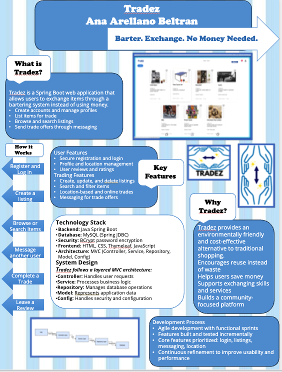
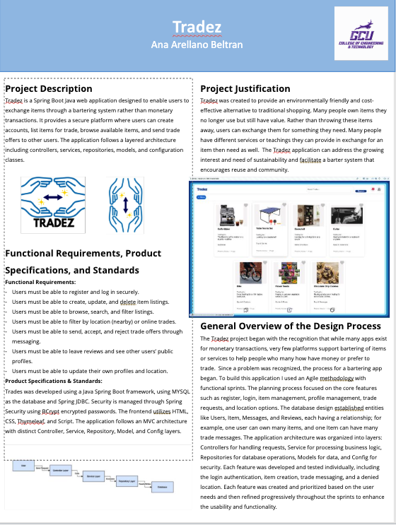

# Tradez

## Overview: 
Tradez is a Spring Boot Java web application that allows users to exchange items and services through a bartering system instead of using money. Users can create accounts, list items, browse listings, and communicate with others to complete trades.

## Demo Video: 
- https://www.loom.com/share/bfb67219e1e04ae8b48fad2eef719534 
- https://www.loom.com/share/a58410e863eb4f60ae19fedf1598aa58 

## Portfolio 
https://canva.link/42rcg6yfxmdvks2 

## Poster 
  

## Other Links 
- https://github.com/anaarellanoo/tradez 
- https://mygcuedu6961-my.sharepoint.com/:x:/g/personal/aarellanob_my_gcu_edu/IQBiMtAXCrLcQYpGqsROPSIjARggTXWwL6-FSMY6Y88c-Ro?e=LkePOp 
- https://mygcuedu6961-my.sharepoint.com/:x:/g/personal/aarellanob_my_gcu_edu/IQBRUlv6IG6fTIp0r5W7PZHZAV5Zy2p_2mfiNkyVX3ujjuM?e=Pkm9HO 
- https://mygcuedu6961-my.sharepoint.com/:x:/g/personal/aarellanob_my_gcu_edu/IQCsD_5EJ9zTT4MpfFyzEuFSAcCN5Ax1iad4kZ_WfX5wuWQ?e=ka9RtH 